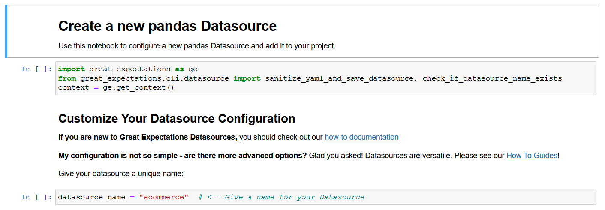
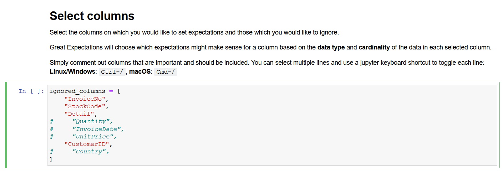
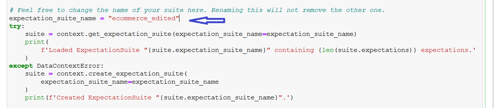
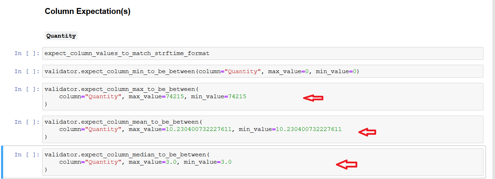
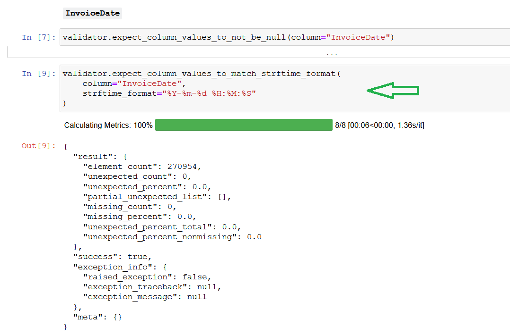
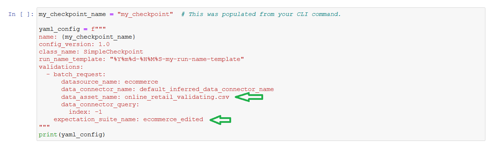
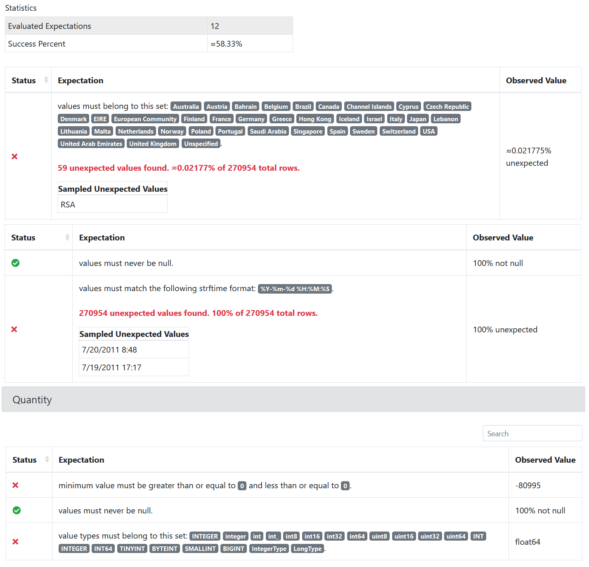
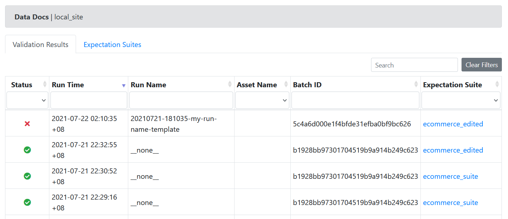

# E-Commerce Data Quality with Great Expectations

## **Table of Contents**

- [E-Commerce Data Quality with Great Expectations](#e-commerce-data-quality-with-great-expectations)
  - [**Table of Contents**](#table-of-contents)
  - [Introduction](#introduction)
  - [Python Environment Setup](#python-environment-setup)
  - [Data Preparation](#data-preparation)
  - [Initialize Great Expectations Workspace](#initialize-great-expectations-workspace)
    - [Key Definitions](#key-definitions)
    - [Steps to Deploy Great Expectations](#steps-to-deploy-great-expectations)
  - [Conclusion](#conclusion)

## Introduction

Ensuring data quality is a crucial step in any data engineering project. Ultimately, the end
goal of data is for stakeholders to make important business decisions. If
the quality of data is not up to scratch, then inaccurate values can impact
the data pipeline/engineering process, and also lead to wrong decisions being
made due to incorrect and inaccurate data.

Here, I will be using an [e-commerce dataset](https://www.kaggle.com/carrie1/ecommerce-data)
to illustrate how [Great Expectations](https://greatexpectations.io/) can be used to ensure
and monitor data quality, for instance, by validating that the latest batch of data
has the expected values or falls within the expected range of numbers. Great Expectations
is a way of providing automated testing, for the purpose of validating, profiling and
documenting your data.

**The aim** is to catch the presence of dirty data, and to test, validate and document
data quality issues using Great Expectations.

## Python Environment Setup

Clone this repo and set up a Python virtual environment, where Great Expectations
can be installed.

    git clone https://github.com/ismaildawoodjee/Great-Expectations-for-CSV
    cd Great-Expectations-for-CSV

Create a virtual environment,

    python -m venv .venv

and activate it (first line for Windows, second for Linux).

    .\.venv\Scripts\Activate.ps1

    source .venv/bin/activate

Install Great Expectations with

    pip install great_expectations

## Data Preparation

The original e-commerce dataset from Kaggle is a single flat file CSV. I divided this
file into two halves, one half is named `online_retail_profiling.csv` and the other
half is named `online_retatil_validating.csv`.

I cleaned the `profiling` file by setting minimum price and quantities to be 0,
and changed invoice date to be the standard `YYYY-MM-DD HH:MM:SS` format, and made
sure that there were no inconsistent country names, such as `United KingdomKingdom`.

For the `validating` file, I introduced fractional quantities into the quantity
column, did not clean the negative prices and quantities, and left the invoice date
format to be as it originally is. Additionally, the `validating` file contains the
country name "RSA" (Republic of South Africa), which is not present in the `profiling`
file.

The aim is to catch the presence of this dirty data, and to test, validate and document
data quality issues using Great Expectations.

## Initialize Great Expectations Workspace

Now that the Python environment has been set up, we can initialize a new
GE (Great Expectations) workspace using the CLI commands for GE Version 3. There
are several definitions that we need to understand when navigating the GE workspace:

### Key Definitions

- **Expectations**: are unit tests for data. They are assertions about data, and
they always start with the prefix `expect_`. All Expectations live in JSON files
located within the `great_expectations/expectations` folder.

- **Data Context**: manages the deployment and configuration of your GE project.
Creating a Data Context is the first step in making use of Great Expectations.

- **Datasource**: a connection to a data directory. This can be a filesystem on
your local machine, a SQL database, or some other storage on the cloud, such as
S3, Redshift, or BigQuery.

- **Expectation Suite**: an Expectation Suite is just a collection of Expectations.

- **Profiling**: a method for GE to quickly generate Expectations based on a sample
batch of data.

- **Validating**: a method to verify the data quality of a batch of data, according
to a set of Expections. This can be done in standalone fashion, without prior profiling,
or can be done after profiling with a sample batch of data.

- **Data Doc**: the Data Doc is a static HTML page, where all the expectations
stored in the `expectations/example_expectation_suite.json` file are rendered into an easily-readable
format for assessing data quality.

- **Checkpoint**: A Checkpoint is a pair between a data batch and its corresponding Expectation
Suite. According to the [docs](https://docs.greatexpectations.io/en/latest/guides/tutorials/getting_started_v3_api/validate_your_data.html),
we could say `Checkpoint A = (Data Batch X, Expectation Suite Y)`, or Checkpoint A
validates Data X against Expectation Suite Y.

### Steps to Deploy Great Expectations

The steps to deploy GE are as follows:

1. **Create a Data Context** by running the CLI command:

        great_expectations --v3-api init

2. **Configure a Datasource**: After creating a data context, we want to configure a Datasource.
Run the CLI command and follow the instructions:

        great_expectations --v3-api datasource new

3. After completing the previous step, a Jupyter Notebook will be opened in your
web browser, which will contain boilerplate code to customize and configure the
Datasource. Here, we want to **give our Datasource a name**, because there may be
many sources of data in your project, and we want to identify them easily.

    

    Run all the cells in order before closing the Notebook.

4. **Create an Expectation Suite**: Next, we need to create an Expectation Suite. This is the step where we can
specify whether we want to write expectations manually or automatically infer
them from a sample batch of data. Create an Expectation Suite with the command below,
and run the Jupyter Notebook cells in order.

        great_expectations --v3-api suite new

    - Option 1: Manual creation of Expectations without a sample batch of data.
    Choose this option if you wish to write Expectations from scratch, and without
    a sample batch of data (for instance, if you have just one file that you want to validate).

    - Option 2: Manual creation of Expectations with a sample batch of data.
    Choose this option if you wish to write Expectations from scratch, but with
    a sample batch of data. The sample batch is used for profiling.

        This option is suitable if you want custom arguments to be passed when
        reading the CSV file. For instance, if I want my file to be encoded with
        "ISO-8859-1", then I can write the arguments in a JSON file and pass it as
        a command line argument, e.g.

            great_expectations --v3-api suite new --batch-request path/to/batch_request.json

        Alternatively, upon completing the set up of a new Expectation Suite, a
        Jupyter Notebook to edit it can be opened, and the `batch_request` arguments
        can be provided there.

        

    - Option 3: Automatic profiling. Choose this option if you want GE to quickly
    come up with a list of Expectations based on a sample batch of data. This initial
    profiling will need to be modified according to your requirements about the data.

        

        However, this option will not work if custom arguments are required to
        read the CSV file. For example, when encoding is not UTF-8, or when the
        delimiter is something other than comma, e.g. pipe or tab delimited data.

        After choosing the method to create an Expectation Suite, choose

            1. default_inferred_data_connector_name

        and then choose the `online_retail_profiling.csv` sample dataset in order to
        set up automatic profiling. In Step 6, the new batch of data will be validated
        based on the Expectations produced by profiling the sample batch.

    Run the all the cells in order to open up a Data Doc.

5. **Edit Expectations**: After running the last cell in the Jupyter Notebook produced from the previous step,
GE will open up a Data Doc in a new browser tab. The initial Expectations in this
Data Doc will not be very ideal for your requirements, so we can edit them by running

        great_expectations --v3-api suite edit ecommerce_suite --interactive

    NOTE: If you are using Version 2, you can run the following command instead:

        great_expectations suite edit ecommerce_suite

    Here, in the Jupyter Notebook, Expectations can be added, removed, or modified.
    First, rename the new suite of Expectations:

    

    Then, I removed the Expectations for max, mean and median values (and other
    unnecessary Expectations as well).

    

    Ensure that datetime is in a specific format, e.g. `%Y-%m-%d %H:%M:%S`. I added
    the `expect_column_values_to_match_strftime_format` here and ran the cell.

    

    After running the final cell, a new Data Doc will be opened, which contains the
    rendered Expectations from the new Expectation Suite.

    For more info, refer to the [official documentation](https://docs.greatexpectations.io/en/latest/guides/how_to_guides/creating_and_editing_expectations/how_to_edit_an_expectation_suite_using_a_disposable_notebook.html)

6. **Validate new batch of data**: Now that we have our Expectation Suite ready,
we can validate a new batch of data against these Expectations. The new data batch for
validation, named `online_retail_validating.csv` contains negative prices, inconsistent
country names, fractional item quantities and a wrong datetime format.

    Validate the new batch with the command:

        great_expectations --v3-api checkpoint new my_checkpoint

    This will open a Jupyter Notebook from which we can set the new data batch
    CSV file to be validated against the `ecommerce_edited.json` Expectation suite.

    

    Upon running all the cells, GE will open up a Data Doc, where we can see that
    five of the Expectations had failed.

    

    Going to `Validation Results` in the `Home` tab indicates that overall validation
    for the new batch of data has failed:

    

    One final task perhaps, would be to use this validation step as a Bash Operator
    within an Airflow DAG, or trigger a notification / send an email when the validation
    step fails.

## Conclusion

Great Expectations provides ways to profile your data, test it against the expectations
for data quality (configured according to your needs), and also provides data documentation based
on these Expectations.

You can either write your Expectations from scratch, using the [multitude of options](https://docs.greatexpectations.io/en/latest/reference/glossary_of_expectations.html)
available, or create [your own Expectations](https://docs.greatexpectations.io/en/latest/guides/how_to_guides/creating_and_editing_expectations/how_to_create_custom_expectations_for_pandas.html)
